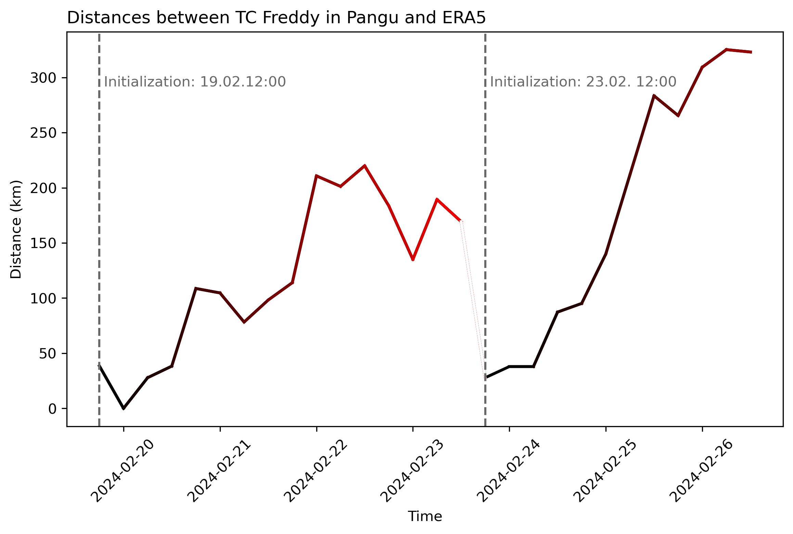

# Tropical Cyclone Freddy

This repository evaluates AI forecasts of Pangu-Weather of the tropical cyclone Freddy by comparing multiple leadtimes with ERA5 reanalysis data. We assessed the AI forecasts concerning their predicitive ability to represent the storm characteristics (wind speed at 500 hPa and mean sea level pressure), the severity of the storm (surface wind speed and specific humidity at 500 hPa), and the accuracy of the location prediction. The results are discussed in the FINAL_REPORT.pdf.

  

## Main results

Pangu-AI weather forecasts underestimated the intensity of the tropical cyclone Freddy and decreased in accuracy in forecasting the precise location of Freddy with increasing lead times since the initialization. 

  

*Distance between the low pressure center of tropical cyclone Freddy in ERA5 and Pangu--AI forecasts from two initializations.*

 

## Folders

### The analysis folder

The `analysis` folder contains the 4 analysis paths on the location of Freddy (01), Freddy's characteristics (02), the storm severity (03), and the differences between Pangu and ERA5 (04).

### The data folder

The `data` folder includes both an overview over the data in the form of notebooks of Pangu output and ERA5 data, as well as the processing routine. The netcdf files are too big to share them here as they span multiple latitudes/longitudes, elevations, over more than a month, and have multiple variables.

### The plots folder

The `plots` folder contains figures that were generated in the analysis and used in the FINAL_REPORT.pdf.
